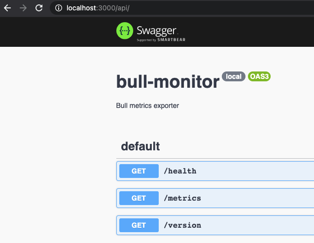

# bull-monitor
This is an all-in-one tool to help you visualize and report on bull! It runs as a docker container that you can spin up with local development or host wherever you see fit. The core goal of this project is to provide realtime integration of your bull queues with existing bull tooling...without needing to run write any custom code. The following is automatically included:

- Automatic discovery of your bull queues (just point this at your redis instance)
- Automatic configuration of prometheus metrics for each discovered queue
- Configurable UI support to visualize bull queues (Bull Board or Arena)

## screenshots





## getting started

To get started:

  docker compose up -d bull-exporter

If you are using `docker-compose` you can add the following:

```yml
bull-exporter:
  image: bull-exporter:latest
  ports: 
    - 3000:3000
  environment:
    REDIS_HOST: <your redis host>
    REDIS_PORT: <your redis port>
    PORT: 3000
    UI: bull-board # or arena
```

You can then create a sample job like this (assuming redis is running at `127.0.0.1:6001`):

```typescript
import Bull from 'bull'

// create queue
const queue = new Bull('send-email', {
    redis: {
        host: 127.0.01,
        port: config.REDIS_PORT
    }
});

// add some dummy processing code
queue.process(async (job) => {
  const delay = Math.floor(Math.random() * config.DELAY_MS)
  console.log(`Starting job: ${job.id} with delay ${delay}`);
  job.log(`Starting job: ${job.id} with delay ${delay}`);

  const fail = Math.round(Math.random()) === 1 
  if (fail) {
    console.log(`Job ${job.id} marked to fail`);
    job.log(`Job ${job.id} marked to fail`);
    throw new Error(`Failing job ${job.id} for random reason`)
  }
  
  console.log(`Job ${job.id} is now complete after the delay`);
  job.log(`Job ${job.id} is now complete after the delay`);
});

// create a job
queue.add({someParam: 'someValue'}, {attempts: 2});
```

The example above creates a job queue called `send-email` with processing code that fails randomly. It creates a single job and attempts it up to 4 times.
## prometheus metrics
For each queue that is created  the following metrics are automatically tracked.

| Metric                              | type    | description                                             |
|-------------------------------------|---------|---------------------------------------------------------|
| jobs_completed_total                | counter | Total number of completed jobs                          |
| jobs_active_total                   | counter | Total number of active jobs (currently being processed) |
| jobs_delayed_total                  | counter | Total number of jobs that will run in the future        |
| jobs_failed_total                   | counter | Total number of failed jobs                             |
| jobs_waiting_total                  | counter | Total number of jobs waiting to be processed            |
| jobs_duration_milliseconds          | summary | Processing time for completed/failed                    |
| jobs_waiting_duration_milliseconds  | summary | Waiting time for completed/failed                       |
| jobs_attempts                       | summary | Processing time for completed/failed/jobs               |

You can configure:
- Refresh queue metrics (default is every 60 seconds)
- Job specific durations are reflected right away
- Labels available
- Queue metrics are GLOBAL not worker specific


Grafana integration
- Locally you can setup prometheus and grafana to simulate what these metrics would look like. See `docker-compose.yml` for an example

## bull ui
There are 2 options currently available for UIs: bull-board and arena.


https://github.com/felixmosh/bull-board#readme
https://github.com/bee-queue/arena
## todo
- Config namespace events - how to ensure this is properly set????
- Clusters - ensure we can scan all queues in a cluster
- Docker container creation
- Github actions to build container and push to docker hub
- Dex/SAML/OIDC login
- Bull dashboard for grafana (to be loaded)
- Istio metrics?
- Screenshots/documentation
- Basic smoke testing
- Code climate / other code quality tools
- Improve smoke testing
- Bull - better queue retrieval methods from redis (using `SCAN` to accomplish this)
- Bull board - public add/remove queues
- Bull arena - public add/remove queues

## security considerations
- Should not be publically accessible in production environment
- Single threaded should not scale

If you want to also run prometheus and grafana:

  docker compose up -d grafana

What's where?
- `/metrics`
- `/health`
- `/api` - swagger documentation of available endpoints
- `/queues` - UI for bull

Other services:
- localhost:3000 - bull exporter
- localhost:6002 - smtp
- localhost:6003 - SMTP Web UI (username: test, password: test)
- localhost:3001 - grafana
- localhost:3002 - prometheus

# contributing
- Open a PR
